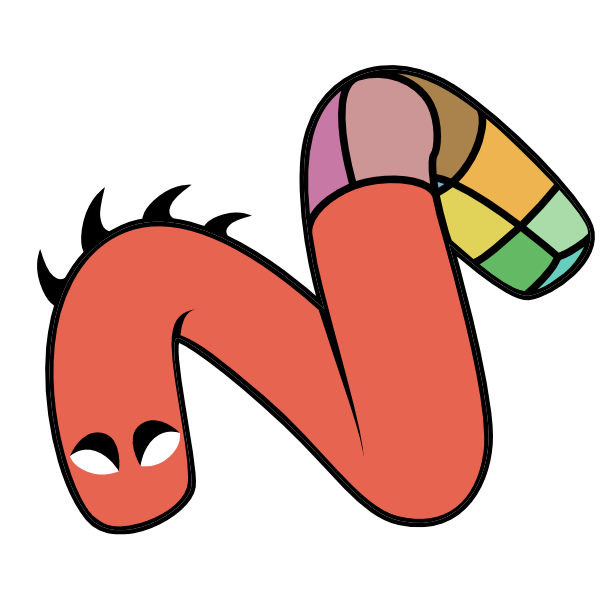

# SMONSTER
Hi everyone.

Today I'm releasing the SMONSTER Kit to public for both Freelance or Studios.
- This kit is production ready.
- If you want to contribute to the development you can.
- Give financial support, i'd appreciated that.

***I must be precise that I will still add things to it in a near future, so please don't consider it as an abandon-ware. I've spent too many times building it to let it go.***

# DETAILS
SMONSTER include 15 Standard Kits (including 2 Beta Kits) and 3 Livelink Kits to simplify integration of other software within Modo and improve your workflow.

`SMONSTER Kit` + `TRAINING kit`

- Now SMONSTER consist of the [SOURCE](https://smoluck.gumroad.com/l/Smonster-v3) Kit + [TRAINING](https://smoluck.gumroad.com/l/SMONSTER_TRAINING) Kit as 2 zip archive. SMONSTER TRAINING Kit is now a separate kit. It contains all the training files.

It's been about 5 years now that i've started to learn Python Scripting over my spare time. It was a though work for a simple 3D Artist, but i won't regret anything i've discovered during that time. It was a great journey, along those years and i will continue to explore that as a Technical Artist.
I've wrapped up about ~250 commands for Modo along many other scripts and UI development.
[MODO](https://www.foundry.com/products/modo) is a hub for me since 2006 and i've got plenty of pleasure using it along other tools.
Some have been so important to my pipeline that i've integrated some Livelink kits for them, like [RizomUV](https://www.rizom-lab.com/), [Marmoset Toolbag](https://marmoset.co/toolbag/) or [Pixaflux](http://pixaflux.com/).
2 Beta kits are dedicated to [Adobe Illustrator](https://www.adobe.com/products/illustrator.html) and Point Cloud workflow. 

To use it at your profit, you can install it in two ways:
- from [GitHub](https://github.com/smoluck/SMONSTER/blob/main/README.md#building-the-kit-from-github)
- from Gumroad for [SMONSTER Kit](https://smoluck.gumroad.com/l/Smonster-v3) and [TRAINING Kit](https://smoluck.gumroad.com/l/SMONSTER_TRAINING)

Enjoy the tools and please give some feedback on Foundry Forum thread or preferably via our [Slack](https://join.slack.com/t/smonster/shared_invite/zt-1dkpid10n-QK4gn4UAk6iG5wv7ISEdnQ) or via [Discord](https://discord.gg/fqgWnbC).

Thanks to the wonderful Modo community and the [PixelFondue](https://www.pixelfondue.com/contributors) Contributor Team that have give me a lot of support on this achievement.

Best regards, Franck Elisabeth.

# Special Thanks
- Fellow-Worker
***(Extriple Team and especially 김주희.)***

- Pixel Fondue Team
***(William Vaughan, Greg Leuenberger, Shawn Frueh, Ymmanuel Flores, Yazan Malkosh, Volker Troy, Wes McDermott, Adam OHern, Eric Soulvie, Ellery Connell, Simon Lundberg, Rich Hurrey, Lukasz Pazera, Richard Yot, Mario Baldi, Lauren Thomas, Volker Troy, Ed Ferrari, Alexander Kucera, Fredrik Widman, James Darknell, Ryan Ernst, Alexander Shmakov, Pascal Nocquet, Steve White, Matt Meersbergen, Pedro Alpiarça dos Santos) )***
- Foundry Team
***(Brad Peebler, Shane Griffith, Greg Brown, Joe Angell, James O'Hare, Matt Cox, Ben Halling, Dejan Javanovic, Yoshiaki Tazaki, Mike Jensen, Michael McCarthy, Duncan Hopkins, Andrew Brown, Chris Hague, Milos Bullat, Darrel Anderson )***
- Modo Community
***( Seneca Menard, Cristóbal Vila, Mateusz Losinski, Daniel Potuznik, Kai, Ricky Scharneck, Warren L, Dino Zanco, Ola Haldor Solvik Voll, Pierre Dubertrand, Dominiek De Ridder, Yoshikai Yuji, Kashif C Rilley, Keith, Oliver Hotz, Robert Lechl, Rodesqa, Pascal Labillois, Leif Mariussen, Leonard Billeke, Francois Caillaud, Felix Leyendecker, Jordan Cain, Elliot Sharp, Dmytro Holub, Thiago Carneiro, Thomas Groppi, Thomas Cheng, Tim Crowson, Dominique Piccinato, Steve Hill, Dmitry Bersenev, Kjell Emanuelsson, Remi Brouet, Mark Tomlinson, Timothee Yeramian, Maxime Rouca, Rouven Miller, Tom Dymond, 이범희, Joost Spek, Chris Fritsche,  Esa Nietula, Vladimir Leleiva, Yuya Takeda, Srecko Micic, Sergio Mucino, Jörg-Mark Kasassoglou, Jawad Altabtabai, Sergio Madeira, Andras Vigyazo, Andreas Rånman, Ian Brown, Michele Faccoli, Iyad Horani, Erwin Zwart, Edward Erickson, Bart Van Doornik, Cem Tezcan, Joseph Senti, Sébastien Grégoire, Scott Neece, Gep, Peter Sims, Chris O'Riley, Gaurav Mathur, Gerard Falla, Gideon Klindt, Luciano Daluz, Jerome Lebrun, Tomasz Lechocinski, Warren, Neil M, Daniel Brok, Martin, Mario Manganelli, Mark White, Martin Kramme Guldbaek, Baroba, Luca Giarrettino, Marcus Kjeldsen, Martin Oberg)***
- (not exhaustive list for sure :^D)

# MENU
- [DETAILS](https://github.com/smoluck/SMONSTER/blob/main/README.md#details)
- [DOCUMENTATION](https://github.com/smoluck/SMONSTER/blob/main/README.md#documentation)
- [GITHUB BUILD](https://github.com/smoluck/SMONSTER/blob/main/README.md#building-the-kit-from-github)
- [LPK DOWNLOAD](https://github.com/smoluck/SMONSTER/blob/main/README.md#lpk-download)
- [INSTALL](https://github.com/smoluck/SMONSTER/blob/main/README.md#install)
- [UPGRADE](https://github.com/smoluck/SMONSTER/blob/main/README.md#upgrade)
- [STANDARD KIT](https://github.com/smoluck/SMONSTER/blob/main/README.md#standard-kit)
- [LIVELINK KIT](https://github.com/smoluck/SMONSTER/blob/main/README.md#livelink-kit)
- [BETA KIT](https://github.com/smoluck/SMONSTER/blob/main/README.md#beta-kit)
- [GETTING STARTED](https://github.com/smoluck/SMONSTER/blob/main/README.md#getting-started)
- [DISCLAIMER](https://github.com/smoluck/SMONSTER/blob/main/README.md#disclaimer)
- [CONTACT](https://github.com/smoluck/SMONSTER/blob/main/README.md#CONTACT)
---

# DOCUMENTATION
- [Online Documentation](https://smonster-doc.readthedocs.io/en/latest)
- [Update Log](https://smonster-doc.readthedocs.io/en/latest/updatelog.html)

# BUILDING from GITHUB
Python version: `2.7` or `3.7`  

Clone this repository locally on your PC using GitHub Desktop.
- To install the kit to your appdata kits directory, run: `install.py` under `SMONSTER`
- To build the lpk file for either the Standard Edition (Compiled scripts) or the Source Edition (Raw Code), run: `build_STANDARD.py` or `build_SOURCE.py` under `SMONSTER/KITS/SMONSTER`

# LPK DOWNLOAD
LPK install file from Gumroad [SMONSTER Kit](https://smoluck.gumroad.com/l/Smonster-v3) and [TRAINING Kit](https://smoluck.gumroad.com/l/SMONSTER_TRAINING)

# INSTALL
After downloading the Zip file from Gumroad or from this GitHub `SMONSTER/KITS/SMONSTER`, please follow those instructions and this [Video](https://youtu.be/nJjRuAxuqhU)
(If you are an owner of SMONSTER V1 or V2, please delete the SMONSTER Folder from your Kits folder Before install)

Method A:  -- Automatic Install via Modo and LPK --
- Follow this [Video](https://youtu.be/nJjRuAxuqhU)
- Open Modo and Drag and Drop the LPK file into Modo Window (Modo should be started with administrator rights to unpack the files).
- Restart Modo

Method B:  -- Manual Install --
- Follow this [Video](https://youtu.be/nJjRuAxuqhU)
- Open the Zip Archive "SMONSTER_V3.XX.zip" and Drag and Drop the LPK file into a temp folder.
- Rename the SMONSTER_V3.XX.lpk to a zip file SMONSTER_V3.XX.zip
- Open you Modo Content Folder and create a new folder under Kits called SMONSTER, and unzip the files from the last renamed zip in it.
- Restart Modo

# INSTALLATION NOTE for MARMOSET LIVELINK
- Make sure to copy this file:	SMO_MARMOSET_MODO_LL.tbbake
- from the Kit folder:		SMONSTER/Kits/SMO_MARMOSET_LIVELINK/Marmoset_Script
- to the folder 		C:/Users/YOUR_NAME/AppData/Local/Marmoset Toolbag 3/baker if you use Marmoset v3
- or/and
- to the folder 		C:/Users/YOUR_NAME/AppData/Local/Marmoset Toolbag 4/baker if you use Marmoset v4

Also check your Modo Preferences/Defaults/Application/Item Index Style: It should be set to (Underscore ) : Item_2

# UPGRADE
As you already have the kit installed, create a backup of the folder as Zip or any archive,
just in case you 'll have any issue with the new one.
The zip file will not be loaded at modo start, you're also free to save it somewhere on a different location.

(If you are an owner of SMONSTER V1 or V2, please delete the SMONSTER Folder from your Kits folder Before install)

- Delete the folder SMONSTER_V2 in your Modo Content Kits folder (Available from Modo/System/Modo Content folder  *Menu*).
- Open Modo and drag n drop the new LPK file in it.
- Restart Modo.
- Now you're ready to go.

# STANDARD KIT LIST
    BAKE (v 1.60)
    BATCH (v 1.70)
    CAD TOOLS (v 3.70)
    CLEANUP (v 1.80)
    COLOR BAR (v 1.80)
    GAME CONTENT (v 9.00)
    MASTER (v 1.30)
    MATH TOOLS (v 1.30)
    MESHOPS (Total Pack v1 + v2 + POLY FUSE 2D) (v 2.30)
    MIFABOMA (v 3.50)
    QUICK TAG (v 2.50)
    UV (v 3.00)
    VENOM (v 2.10)
        
    
# LIVELINK KIT LIST
    MARMOSET TOOLBAG (v2.50)
    PIXAFLUX (v 1.30)
    RIZOM UV (v 2.55)
    
    
# BETA KIT LIST
    AI TOOLS (v0.99)
    PCLOUD XYZ (v 0.95)

# GETTING STARTED
[Install and keymaps](https://youtu.be/nJjRuAxuqhU)

# DISCLAIMER
You need at least Modo `15.0` to run `100 %` of the scripts included.
I try to keep compatibility from `15.0` to `16.X`.
As usual if you found a bug, please reach me out on SNS and i will do my best to help you and fix this.

`You ALWAYS need to have SMO_MASTER ans SMOONSTER Kit up and running to use the commands in the kit`

# CONTACT:
[My Website](https://smoluck.com)

[My Gumroad](https://smoluck.gumroad.com)

[My Twitter](https://twitter.com/sm0luck)

[SMONSTER Discord Server](https://discord.gg/fqgWnbC)

[SMONSTER Slack server](https://join.slack.com/t/smonster/shared_invite/zt-1dkpid10n-QK4gn4UAk6iG5wv7ISEdnQ)

[Foundry Modo Slack server](https://foundry-modo.slack.com)

[Foundry Forums thread](https://community.foundry.com/discuss/topic/159978)
